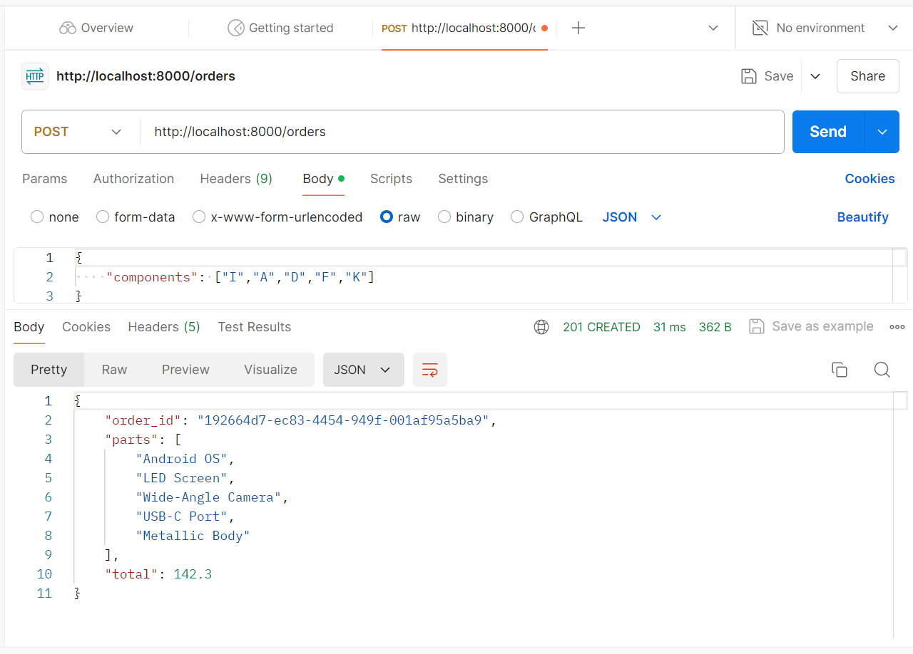

# Mobile Factory Pvt Ltd.

>Python Flask Personalized Mobile Factory app, this project implements a simple API for creating orders for configurable mobile phones. Users can specify the components they want in their mobile phone, and the system calculates the total price of the order.

When ordering a mobile, a customer must configure the following parts:
      - Screen (LED, OLED or AMOLED)
      - Camera (Wide-Angle or Ultra-Wide-Angle)
      - Port (USB-C, Micro-USB or Lightning)
      - OS (Android or iOS)
      - Body (Metal or Plastic)
An order will be valid if it contains one, and only one, part of Screen, Camera, Port, OS and Body. If an order is valid, the priced order should be calculated.

## How It Works

- The API provides an endpoint `/orders` that accepts POST requests with JSON data specifying the components of the personalized mobile phone.
- The components include: screen type (LED, OLED or AMOLED), camera type (Wide-Angle or Ultra-Wide-Angle), port type (USB-C, Micro-USB or Lightning), operating system (Android or iOS), and body type (Metal or Plastic).
- Each component has a corresponding price, and the total price of the order is calculated by adding all the indvidual selected component prices.
- The API validates the combination of components to ensure that it contains one, and only one, part of each type.
- Upon successful validation, the API generates a unique order ID using UUID and returns a JSON response with the order details, including the order ID, total price, and selected components.

## Instructions

To run the project locally, follow these steps:

1. Make sure you have Python and VS code installed on your system.
2. Clone this project code to your local machine.
3. Navigate to the project directory in your terminal.

4. Run the following commands in the VS code terminal:-
    -> pip install virtualenv (Installing Virtual Environment)
    -> virtualenv env (Creating a Virtual Environment in your directory)
    -> .\env\Scripts\activate.sp1 (Activating Virtual Environment)
    -> pip install flask (Installing Flask)
    -> python app.py  (Runing the Flask application)

5. Once the Flask application is running, you can send POST requests to the `/orders` endpoint using tools like Postman to send HTTP requests:-
    ->Open Postman.
    ->Select the request type as "POST".
    ->Enter the request URL as http://localhost:8000/orders.
    ->Go to the "Body" tab, select "raw", and choose "JSON" from the dropdown.
    ->Paste the JSON data {"components": ["I","A","D","F","K"]} into the body.
    ->Click "Send" to send the request.
This will send a POST request to your Flask server running locally on port 8000 with the specified JSON data in the body. 

6. You will receive a JSON response with the order details if the request is successful.

## Unit Testing

>Unit testing is an essential part of software development that helps ensure the correctness and reliability of your code. In this project, we include unit tests to verify the behavior of our Flask application's endpoints.

### Running the Tests

    1. Navigate to the Project Directory: Open a terminal or command prompt and navigate to the directory where your Flask application is located.
    2. Activate Virtual Environment (Optional): If you're using a virtual environment to manage dependencies, activate it using the appropriate command.
    3. Run the Tests: Execute the `test_app.py` file using "python test_app.py"

## Dependencies

- Flask: A micro web framework for Python.
- uuid: A module for generating UUIDs (Generating OrderID).

